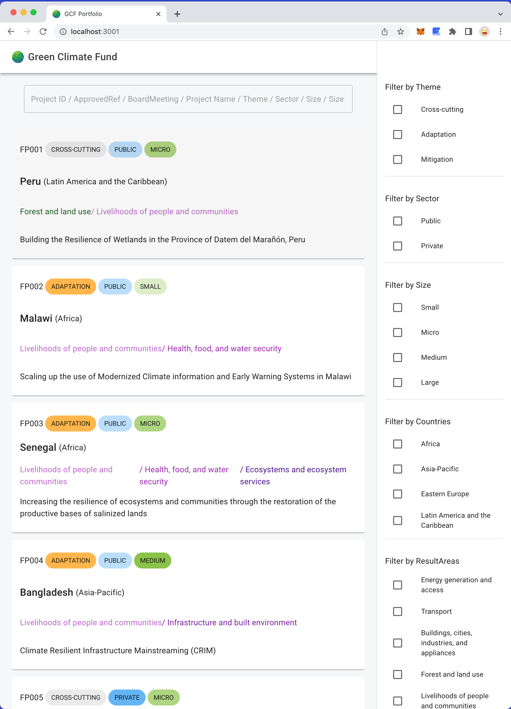
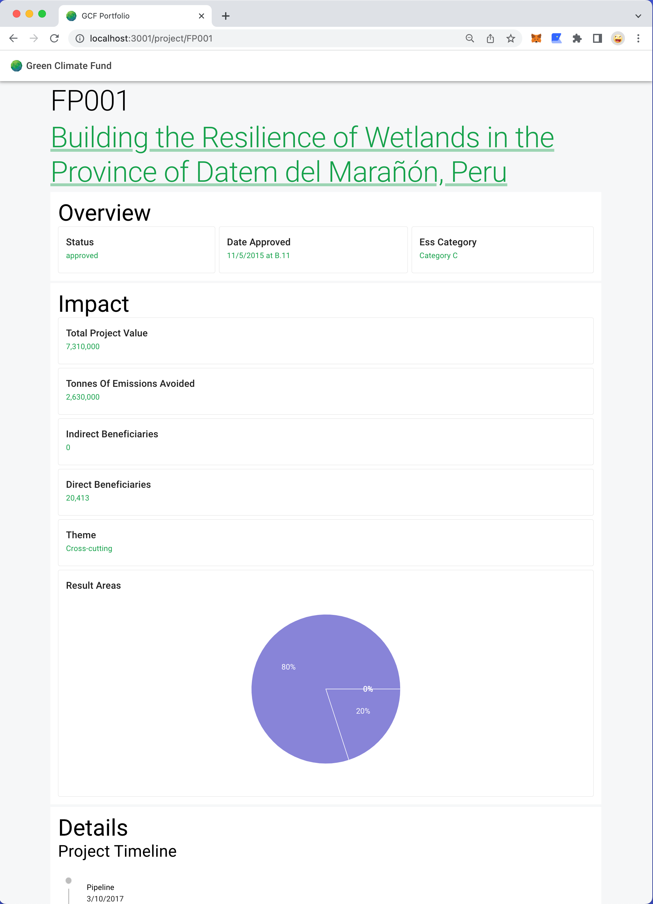

# GCF Portfolio

## Tech Stack

- CRA, Express, Javascript

## How to run locally

- (developed with node version v18.14.0)
- `yarn install`
- `node server.js` (will run on port 3000)
- `yarn start` (will run on port 3001)

## Files

- `server.js`: express server to call `https://api.gcfund.org/v1/projects`, filter projects, and return project detail by id
- `App.js`: where routes, MUI theme, appBar is kept
- `src/components`: common components
- `src/pages`: page components
  - `src/pages/ProjectDetail.jsx`: detail page of project (for route `/project/:id`)
  - `src/pages/Projects.jsx`: main page that shows project list and filters (for route `/`)

## Packages

- `MUI`: to create fast styled UI components
- `recharts`: to create pie chart in project detail page
- `emotion`: to use css
- `axios`: to use when fetching data
- `react-window-infinite-loader`: to implement infinite loading in main page
- `query-string`: to parse/stringify query strings
- `use-query-params`: to set query string in route when adding filter to main page
- `fuse.js`: to implement search from json file
- `luxon`: to format datetime
- `express`: to create server

## Notes

- There is an issue of pages being loaded twice
